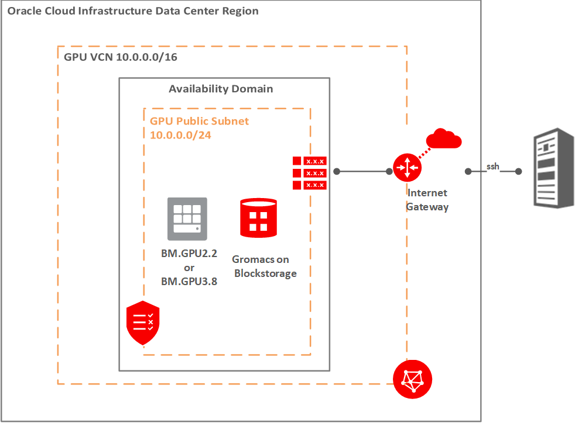

#  oci-hpc-runbook-gromacs

# Introduction
This Runbook provides the steps to deploy a GPU machine on Oracle Cloud Infrastructure, install Gromacs, and run a benchmark using Gromacs software.  

Gromacs is a molecular dynamics software that simulates the movements of atoms in biomolecules under a predefined set of conditions.  It is used to identify the behavior of these biomolecules when exposed to changes in temperature, pressure and other inputs that mimic the actual conditions encountered in a living organism.  Gromacs can be used to establish patterns in protein folding, protein-ligand binding, and cell membrane transport, making it a very useful application for drug research and discovery.

Gromacs supports running on CPU's or GPU's and supports parallel processing. It was developed by the University of Gronigen and is now maintained by various contributors around the world. More information can be found [here](http://www.gromacs.org/).

 

# Architecture
The architecture for this runbook is simple, a single machine running inside of an OCI VCN with a public subnet.  
Since a GPU instance is used, block storage is attached to the instance and installed with the Gromacs application. 
The instance is located in a public subnet and assigned a public ip, which can be accessed via ssh.

For details of the architecture, see [_Deploy molecular dynamics and GROMACS applications_](https://docs.oracle.com/en/solutions/deploy-gromacs-on-oci/index.html)

## Architecture Diagram




# Login
Login to the using opc as a username:
```
   ssh {username}\@{bm-public-ip-address} -i id_rsa
```
Note that if you are using resource manager, obtain the private key from the output and save on your local machine. 

# Prerequisites

- Permission to `manage` the following types of resources in your Oracle Cloud Infrastructure tenancy: `vcns`, `internet-gateways`, `route-tables`, `security-lists`, `subnets`, and `instances`.

- Quota to create the following resources: 1 VCN, 1 subnet, 1 Internet Gateway, 1 route rules, and 1 GPU (VM/BM) compute instance.

If you don't have the required permissions and quota, contact your tenancy administrator. See [Policy Reference](https://docs.cloud.oracle.com/en-us/iaas/Content/Identity/Reference/policyreference.htm), [Service Limits](https://docs.cloud.oracle.com/en-us/iaas/Content/General/Concepts/servicelimits.htm), [Compartment Quotas](https://docs.cloud.oracle.com/iaas/Content/General/Concepts/resourcequotas.htm).

# Deployment
Deploying this architecture on OCI can be done in different ways:

## Deploy Using Oracle Resource Manager

1. Click [](https://cloud.oracle.com/resourcemanager/stacks/create?region=home&zipUrl=https://github.com/oracle-quickstart/oci-hpc-runbook-gromacs/releases/latest/download/oci-hpc-runbook-gromacs-stack-latest.zip)

    If you aren't already signed in, when prompted, enter the tenancy and user credentials.

2. Review and accept the terms and conditions.

3. Select the region where you want to deploy the stack.

4. Follow the on-screen prompts and instructions to create the stack.

   a. In the Compute node options section, choose the following for the Image OCID `Oracle-Linux-7.9-Gen2-GPU-2021.12.14-0`
    

5. After creating the stack, click **Terraform Actions**, and select **Plan**.

6. Wait for the job to be completed, and review the plan.

    To make any changes, return to the Stack Details page, click **Edit Stack**, and make the required changes. Then, run the **Plan** action again.

7. If no further changes are necessary, return to the Stack Details page, click **Terraform Actions**, and select **Apply**. 

## Deploy Using the Terraform CLI

### Clone the Module
Now, you'll want a local copy of this repo. You can make that with the commands:

    git clone https://github.com/oracle-quickstart/oci-hpc-runbook-gromacs.git
    cd oci-hpc-runbook-gromacs
    ls

### Set Up and Configure Terraform

1. Complete the prerequisites described [here](https://github.com/cloud-partners/oci-prerequisites).

2. Create a `terraform.tfvars` file, and specify the following variables:

```
# Authentication
tenancy_ocid         = "<tenancy_ocid>"
user_ocid            = "<user_ocid>"
fingerprint          = "<finger_print>"
private_key_path     = "<pem_private_key_path>"

# Region
region = "<oci_region>"

# Compartment
compartment_ocid = "<compartment_ocid>"

# Availability Domain
availablity_domain_name = "<availablity_domain_name>" # for example GrCH:US-ASHBURN-AD-1

````
### Create the Resources
Run the following commands:

    terraform init
    terraform plan
    terraform apply

### Destroy the Deployment
When you no longer need the deployment, you can run this command to destroy the resources:

## Deploy Using OCI Console

* The [web console](https://github.com/oracle-quickstart/oci-hpc-runbook-gromacs/blob/master/Documentation/ManualDeployment.md#deployment-via-web-console) let you create each piece of the architecture one by one from a webbrowser. This can be used to avoid any terraform scripting or using existing templates. 

## Licensing
See [Third Party Licenses](https://github.com/oracle-quickstart/oci-hpc-runbook-gromacs/blob/master/Third_Party_Licenses) for Gromacs and terraform licensing, including dependencies used in this tutorial.

## Running the Application
If the provided terraform scripts are used to launch the application, Gromacs is installed in the /mnt/block/gromacs folder and the example benchmarking model is available in /mnt/block/work folder. Run Gromacs via the following commands:

1. Run Gromacs on OCI GPU shapes via the following command:
   ```
    gmx mdrun -s <file path> -ntmpi <# of cores> -gpu_id <GPU devices to use>
   ```
   where:
     * mdrun = program that reads the input file and execues the computational chemistry analysis
     * -s = the input file
     * -ntmpi = the number of thread-MPI threads to start 
     * -gpu_id = the string of digits (without delimiter) representing device id-s of the GPUs to be used

   Example for VM.GPU2.1:
   ```
   gmx mdrun -s gromacs_benchMEM.tpr
   ```

   Example for BM.GPU2.2:
   ```
   gmx mdrun -s gromacs_benchMEM.tpr -ntmpi 24 -gpu_id 01
   ```

   Example for BM.GPU3.8:
   ```
   gmx mdrun -s gromacs_benchMEM.tpr -ntmpi 48 -gpu_id 01234567
   ```

2. Once the run is complete, refer to the bottom of the terminal for performance numbers. The run will show the ns/day for the number of cores that were run.


## Post-processing

For post-processing, you can use Visual Molecular Dynamics (VMD) software to analyze the models.
Run the following commands to configure VMD:
```
./configure
cd src
sudo make install
```

If you are using vnc, launch vncserver and create a vnc password as follows:
```
sudo systemctl start vncserver@:1.service
sudo systemctl enable vncserver@:1.service
vncserver
vncpasswd
```

Start up a vnc connection using localhost:5901 (ensure tunneling is configured), and run the following commands to start up VMD:
```
vmd
```

Open the pdb files of your models and start analyzing!
